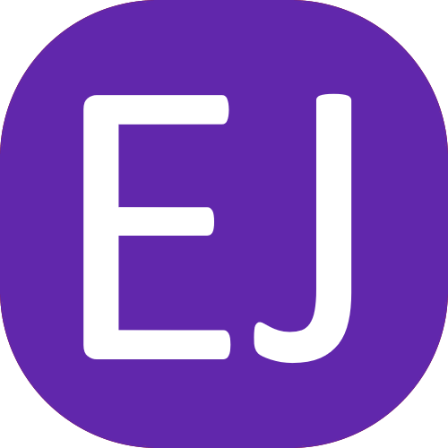
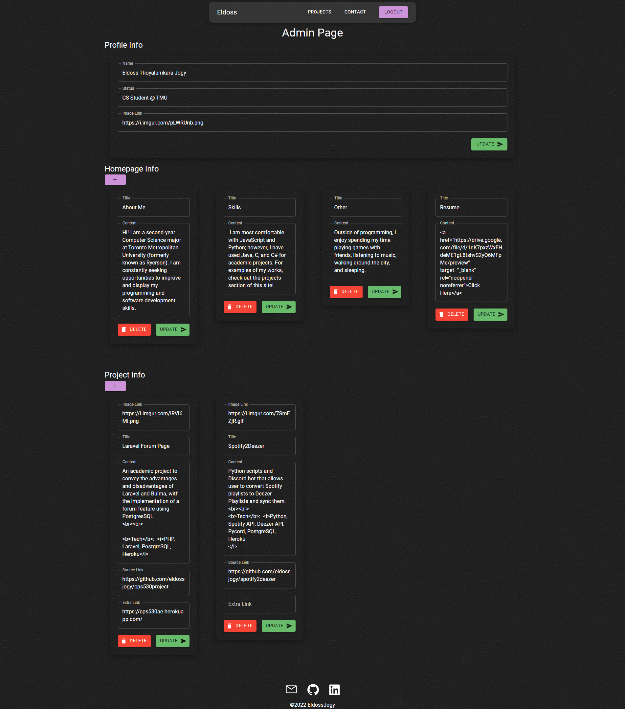

<p align="center">
  <a href="" rel="noopener">
</a>
</p>

<h3 align="center">Portfolio Website</h3>
 
## About 

A dynamic content portfolio website. Developed using Mongodb, NextJS, ReactJs and Material UI for a simple and powerful interface. Mobile responsive using media queries and the Material UI library's responsive features. Includes an admin page with the ability to change content on the page, using internal API to update data on the database.

##  Deployment
🔗 [Visit Website](https://eldossjogy.vercel.app/)


##  Built Using 

- [ReactJs](https://reactjs.org/) - Web Framework
- [NextJs](https://nextjs.org/) - Server Framework
- [NextAuth](https://next-auth.js.org/) - Authentication Framework
- [MongoDB](https://www.mongodb.com/) - Database
- [Vercel](https://vercel.com/) - Deployment Platform

##  Admin Page Screenshot 
</a>

## Getting Started

### Prerequisites
Create a file in the root directory with the name `.env.local` containing the filled information of the `.env.example` file.
 
Install packages:
```bash
npm install
```

### Build

Run the development server:
```bash
npm run dev
# or
yarn dev
```

Open [http://localhost:3000/](http://localhost:3000/) with your browser to see the result.

You can start editing the page by modifying `pages/index.js`. The page auto-updates as you edit the file.

[API routes](https://nextjs.org/docs/api-routes/introduction) can be accessed on [http://localhost:3000/api/hello](http://localhost:3000/hello). This endpoint can be edited in `pages/api/hello.js`.

The `pages/api` directory is mapped to `/api/*`. Files in this directory are treated as [API routes](https://nextjs.org/docs/api-routes/introduction) instead of React pages.
 
